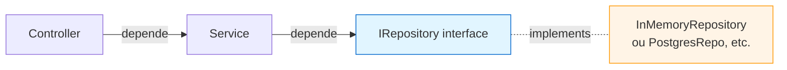
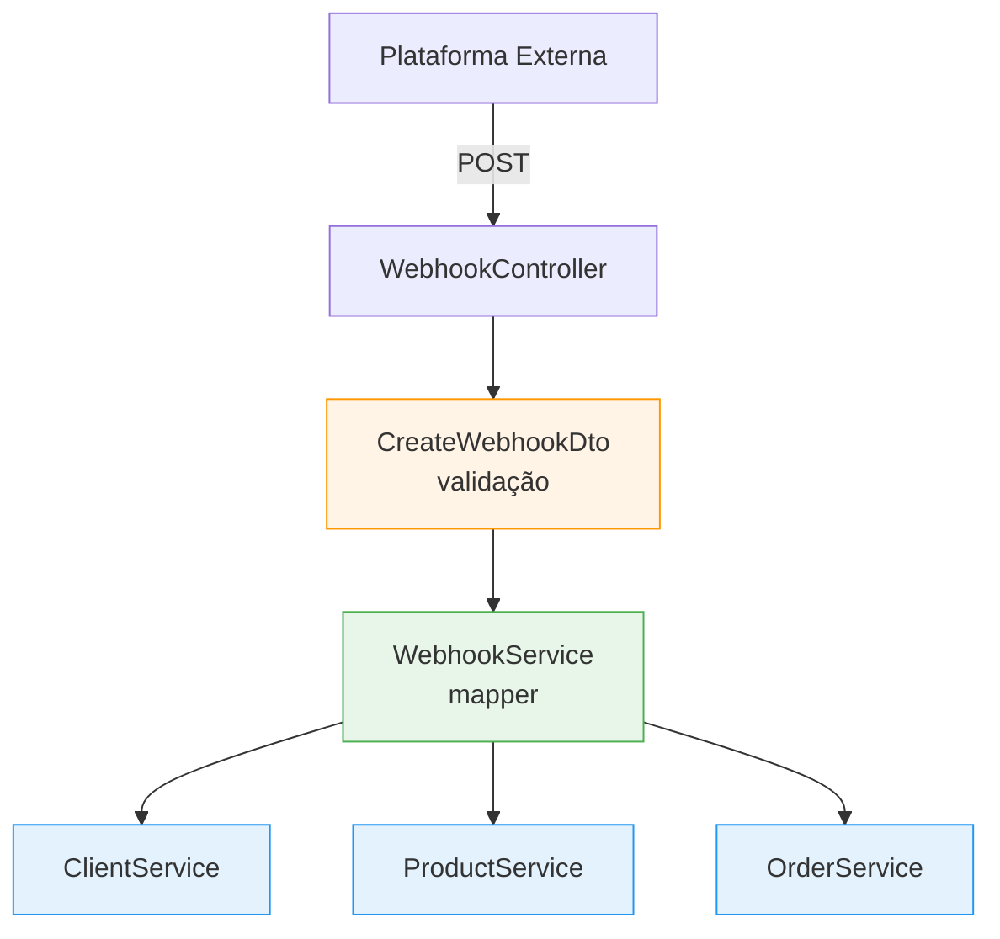
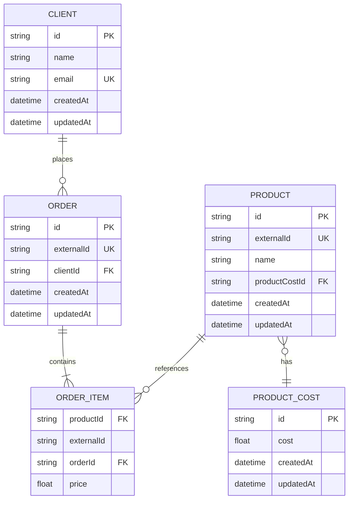

# Teste Técnico — BK Company

**Desenvolvedor Fullstack** | **Stack:** React + NestJS + Class Validator

📹 [Vídeo de apresentação](https://drive.google.com/drive/folders/1A_-TCtx1bPU9dZ-e0EM_di_-3jAXU_vI?usp=sharing)

---

## Visão Geral

Sistema fullstack de gerenciamento de pedidos, produtos e clientes com ingestão via webhook, dashboard analítico e interface administrativa. O backend expõe uma API REST completamente documentada via Swagger, e o frontend consome tipos gerados automaticamente a partir do OpenAPI, garantindo **consistência total** entre back e front.

## Stack Técnica

| Camada          | Tecnologia                                                                 |
| --------------- | -------------------------------------------------------------------------- |
| **Backend**     | NestJS 11, TypeScript, class-validator, class-transformer, Swagger/OpenAPI |
| **Frontend**    | React 19, TypeScript, Vite 7, Tailwind CSS 4, Recharts, lucide-react       |
| **Tipagem API** | openapi-typescript (geração automática de tipos a partir do Swagger JSON)  |
| **Infra**       | Docker multi-stage build, Nginx (proxy reverso + SPA), Docker Compose      |
| **Testes**      | Jest, Supertest (e2e)                                                      |

---

## Arquitetura & Princípios SOLID

### Open/Closed Principle (OCP)

O sistema é **aberto para extensão e fechado para modificação**. Toda persistência é abstraída por interfaces de repositório (`IProductRepository`, `IClientRepository`, `IOrderRepository`, `IProductCostRepository`), registradas via tokens simbólicos (`Symbol`). Trocar o storage de in-memory para PostgreSQL, MongoDB ou qualquer outra implementação exige apenas:

1. Criar uma nova classe que implementa a interface (ex: `ProductPostgresRepository implements IProductRepository`)
2. Alterar o binding no módulo NestJS:

```typescript
// product.module.ts — basta trocar a implementação
{
  provide: PRODUCT_REPOSITORY,
  useClass: ProductPostgresRepository, // antes: ProductInMemoryRepository
}
```

Nenhum service, controller ou lógica de domínio precisa ser alterado.

### Dependency Inversion Principle (DIP)

Módulos de alto nível (services) **não dependem de módulos de baixo nível** (repositórios concretos). Ambos dependem de **abstrações**:



Os services recebem repositórios via `@Inject(SYMBOL)` — nunca instanciam diretamente. O NestJS resolve a dependência em tempo de execução pelo token registrado no módulo.

### Webhook Mapper — Isolamento da Lógica de Domínio

O `WebhookService` atua como **mapper/adapter** entre o formato externo da plataforma e as entidades de domínio. O DTO `CreateWebhookDto` define o contrato de entrada com validação via `class-validator`, enquanto internamente o serviço traduz para chamadas dos services de domínio (`ClientService`, `ProductService`, `OrderService`):



Para suportar um **novo formato de plataforma**, basta:

- Criar um novo DTO (ex: `CreateShopifyWebhookDto`)
- Criar um novo método no `WebhookService` (ou um novo service)
- Adicionar um novo endpoint no controller

**Nenhuma modificação** nos services de domínio existentes é necessária.

---

## Repositórios Abstratos

Cada entidade possui uma interface de repositório com contrato bem definido:

| Interface                | Métodos                                                                                                                            | Token                     |
| ------------------------ | ---------------------------------------------------------------------------------------------------------------------------------- | ------------------------- |
| `IProductRepository`     | `create`, `findAll`, `findById`, `findByExternalId`, `update`, `delete`                                                            | `PRODUCT_REPOSITORY`      |
| `IProductCostRepository` | `create`, `findAll`, `findById`, `update`, `delete`                                                                                | `PRODUCT_COST_REPOSITORY` |
| `IOrderRepository`       | `create`, `findAll`, `findAllWithItems`, `findById`, `findByIdWithItems`, `findByExternalId`, `findByClientId`, `update`, `delete` | `ORDER_REPOSITORY`        |
| `IClientRepository`      | `create`, `findAll`, `findById`, `findByEmail`, `update`, `delete`                                                                 | `CLIENT_REPOSITORY`       |

A implementação atual é **in-memory** — ideal para testes e demonstração sem dependências externas.

---

## Swagger — Documentação Completa

Todas as rotas possuem decorators `@ApiOperation`, `@ApiResponse`, `@ApiBody`, `@ApiParam` e `@ApiQuery`. Os DTOs de response implementam as entidades (`implements Product`, `implements Order`, etc.), garantindo que o schema Swagger reflita fielmente os tipos do domínio.

**Swagger UI:** `http://localhost:3000/docs`

### Rotas Disponíveis

| Método   | Rota                       | Descrição                                  |
| -------- | -------------------------- | ------------------------------------------ |
| `POST`   | `/webhooks/external-order` | Receber pedido de plataforma externa       |
| `GET`    | `/dashboard`               | Dados consolidados (KPIs + série temporal) |
| `POST`   | `/product`                 | Criar produto                              |
| `GET`    | `/product`                 | Listar produtos                            |
| `GET`    | `/product/with-cost`       | Listar produtos com custos                 |
| `GET`    | `/product/:id`             | Buscar produto por ID                      |
| `PATCH`  | `/product/:id`             | Atualizar produto                          |
| `DELETE` | `/product/:id`             | Remover produto                            |
| `GET`    | `/product/cost/all`        | Listar custos                              |
| `POST`   | `/product/cost`            | Criar custo de produto                     |
| `PATCH`  | `/product/cost/:id`        | Atualizar custo                            |
| `POST`   | `/order`                   | Criar pedido                               |
| `GET`    | `/order`                   | Listar pedidos                             |
| `GET`    | `/order/with-items`        | Listar pedidos com itens                   |
| `GET`    | `/order/:id`               | Buscar pedido                              |
| `GET`    | `/order/:id/items`         | Buscar pedido com itens                    |
| `PATCH`  | `/order/:id`               | Atualizar pedido                           |
| `DELETE` | `/order/:id`               | Remover pedido                             |
| `POST`   | `/client`                  | Criar cliente                              |
| `GET`    | `/client`                  | Listar clientes                            |
| `GET`    | `/client/:id`              | Buscar cliente                             |
| `PATCH`  | `/client/:id`              | Atualizar cliente                          |
| `DELETE` | `/client/:id`              | Remover cliente                            |

---

## Frontend — Tipos do OpenAPI

O frontend gera interfaces TypeScript automaticamente a partir do Swagger JSON:

```bash
npm run generate-api-types
# npx openapi-typescript http://localhost:3000/docs-json -o src/api/schema.d.ts
```

O arquivo `schema.d.ts` (auto-gerado) é consumido via re-exports tipados em `types.ts`:

```typescript
import type { components } from "./schema";
export type ProductResponse = components["schemas"]["ProductResponseDto"];
export type OrderResponse = components["schemas"]["OrderResponseDto"];
// ...
```

Isso garante que **qualquer alteração nos DTOs do backend** se propague automaticamente para o frontend após regeneração, eliminando inconsistências.

### Seções do Frontend

| Componente         | Funcionalidade                                                                           |
| ------------------ | ---------------------------------------------------------------------------------------- |
| `DashboardSection` | KPIs (lucro, faturamento, custo, total pedidos) + gráfico de série temporal com Recharts |
| `OrdersSection`    | Tabela de pedidos com nome do cliente, data, total + modal de detalhes com itens         |
| `ProductsSection`  | CRUD de produtos com edição inline de custos                                             |

**UI:** Tailwind CSS v4 + componentes próprios (Button, Card, Dialog, Table, Input, Label) com `class-variance-authority`.

---

## Entidades



---

## Como Rodar

### Pré-requisitos

- **Node.js 22+**
- **npm** (incluso com Node)
- **Docker & Docker Compose** (para deploy containerizado)

---

### 🖥️ Localmente (sem Docker)

**1. Backend**

```bash
cd backend
npm install
npm run start:dev
```

O backend sobe em `http://localhost:3000`. Swagger em `http://localhost:3000/docs`.

**2. Frontend**

```bash
cd frontend
npm install
npm run dev
```

O frontend sobe em `http://localhost:5173`.

---

### 🐳 Docker (produção)

```bash
docker compose up --build
```

| Serviço       | URL                          |
| ------------- | ---------------------------- |
| Frontend      | `http://localhost:8080`      |
| Backend (API) | `http://localhost:3000`      |
| Swagger Docs  | `http://localhost:3000/docs` |

O Nginx do frontend faz proxy reverso: requisições em `/api/*` são redirecionadas para o backend, e `/docs` serve o Swagger.

---

## Estrutura do Projeto

```
BK-products/
├── docker-compose.yml
├── backend/
│   ├── Dockerfile
│   ├── package.json
│   └── src/
│       ├── main.ts                    # Bootstrap + Swagger setup
│       ├── app.module.ts              # Módulo raiz
│       ├── webhook/                   # Ingestão de pedidos externos
│       │   ├── webhook.controller.ts
│       │   ├── webhook.service.ts     # Mapper: payload externo → domínio
│       │   └── dto/
│       │       └── create-webhook.dto.ts  # Validação com class-validator
│       ├── product/
│       │   ├── product.controller.ts
│       │   ├── product.service.ts
│       │   ├── product.module.ts      # DI: token → implementação
│       │   ├── entities/
│       │   ├── dto/
│       │   └── repositories/
│       │       ├── product.repository.interface.ts
│       │       ├── product-in-memory.repository.ts
│       │       ├── product-cost.repository.interface.ts
│       │       └── product-cost-in-memory.repository.ts
│       ├── order/                     # (mesma estrutura)
│       ├── client/                    # (mesma estrutura)
│       └── dashboard/
│           ├── dashboard.service.ts   # KPIs + série temporal
│           └── dto/
└── frontend/
    ├── Dockerfile
    ├── nginx.conf                     # Proxy reverso /api → backend
    ├── package.json
    └── src/
        ├── App.tsx
        ├── api/
        │   ├── client.ts              # Funções HTTP tipadas
        │   ├── types.ts               # Re-exports do OpenAPI
        │   └── schema.d.ts            # Auto-gerado pelo openapi-typescript
        ├── components/
        │   ├── sections/              # DashboardSection, OrdersSection, ProductsSection
        │   └── ui/                    # Button, Card, Dialog, Table, Input, Label
        └── lib/
            └── utils.ts               # cn(), formatCurrency(), formatDate()
```

---
